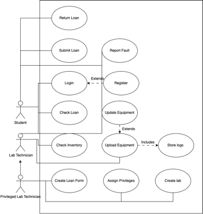
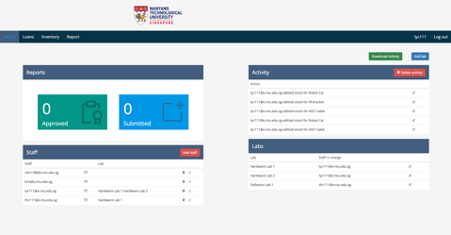
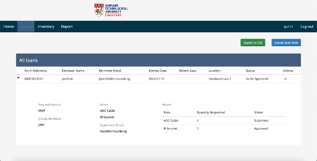

# Lab loans management system
This project is a modified version of my final year project on a lab loans management system for NTU. It is built on NodeJS, React and MySQL. 

### Problem Statement 
Lab technicians rely on manual processes for managing equipment loans to students and staff. This manner of record keeping is space inefficient, time consuming and error prone. Lab technicians want a system that will automate this process. This project will digitize loaning of equipment and track loan records for stock keeping in labs. It aims to streamline loan management and provide accurate stock keeping for lab technicians.

### Project Objectives 
In view of the challenges faced with the current process flow, the loan management system will be developed for the following main purposes:

1.	Replace manual loan forms and inventory forms with digitized forms to eliminate the need to store these forms. 
2.	Reduce user related errors in filling in of loan forms to increase efficiency of the loan process. 
3.	Track loan form statuses to allow lab technicians to have an overview of overall lab loans. 
4.	Increase data integrity by standardizing manners of which item stock is updated, creating room for future expansion of the system. 
5.	Automated adjustment of stock levels based on items on loan, faulty items and discarded items. 
6.	Ensuring security by allowing certain actions to be performed only by users with appropriate access rights. 

**Use Case Diagram** 

#### Screenshots 
This section contains a few screenshots of the system. (Yes, I could defintely use a designer.)

Staff Home Page 
Lab technicians can view an overview of reports, check access rights, view labs and view activity in the home page. Privileged lab technicians have abilities like adding new staff to the system or changing access rights. When a new user is added, a temporary password that is randomly generated by the system would be sent to the staff's email with login details. 

Staff Loan Page 

Modals are used whenever staff does any create/update or delete operations. For instance: 
